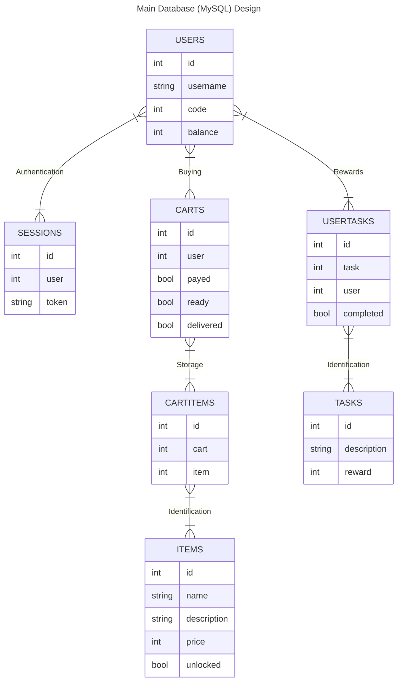

# Database Design

## Main Database (MySQL) Design

```mermaid
---
title: Main Database (MySQL) Design
---

erDiagram
    USERS {
        int id
        string username
        int code
        int balance
    }
    SESSIONS {
        int id
        int user
        string token
    }
    USERS }|--|{ SESSIONS : Authentication

    CARTS {
        int id
        int user
        bool payed
        bool ready
        bool delivered
    }
    USERS }|--|{ CARTS : Buying

    CARTITEMS {
        int id
        int cart
        int item
    }
    CARTS }|--|{ CARTITEMS : Storage

    ITEMS {
        int id
        string name
        string description
        int price
        bool unlocked
    }
    CARTITEMS }|--|{ ITEMS : Identification

    USERTASKS {
        int id
        int task
        int user
        bool completed
    }
    USERS }|--|{ USERTASKS : Rewards

    TASKS {
        int id
        string description
        int reward
    }
    USERTASKS }|--|{ TASKS : Identification
```
