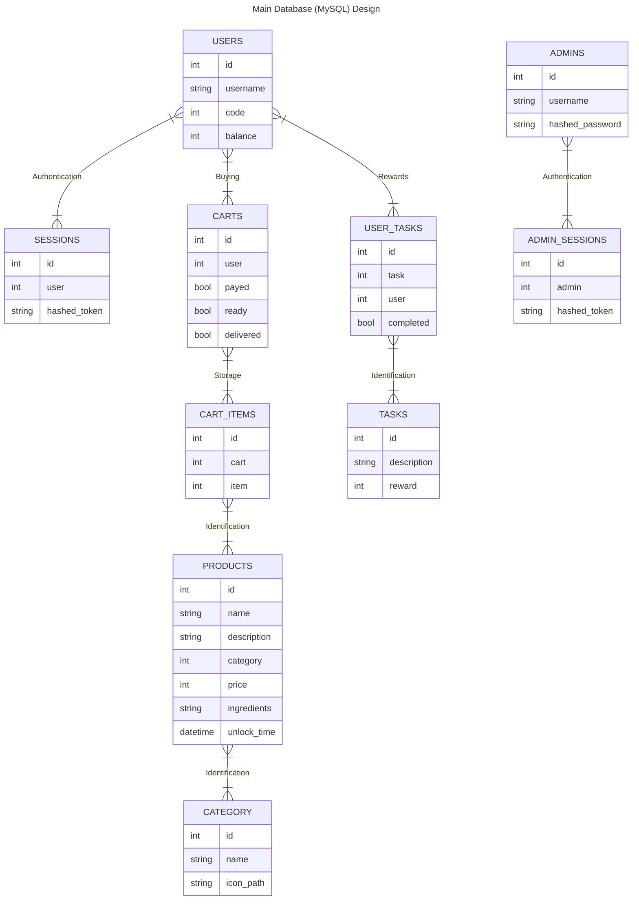

# Database Design

## Main Database (MySQL) Design

The database stores almost all data. It is used for authentication users and admins and stores the cart / order information for each user. It als stores data about available products and their categories.

Furthermore, the credentials and authentication for admins / bartenders are stored in here.

