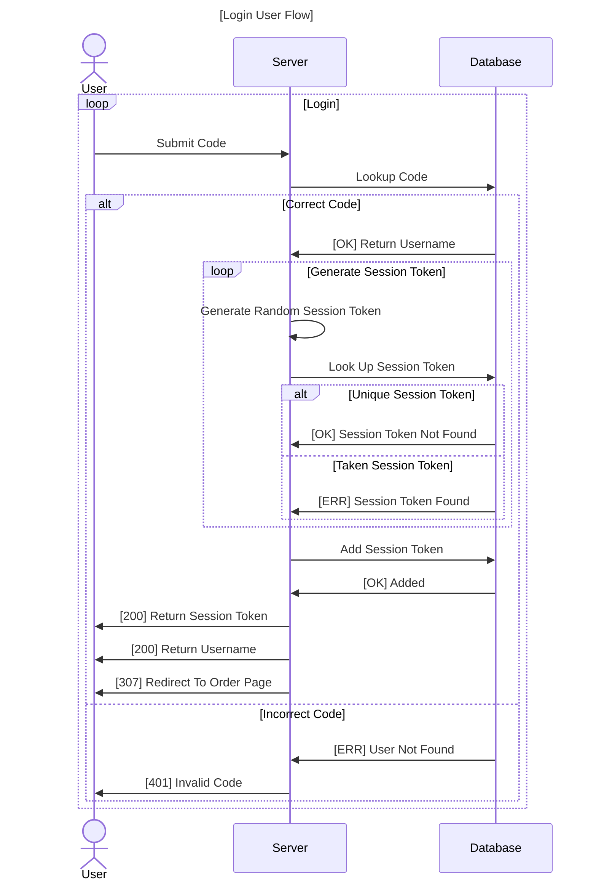
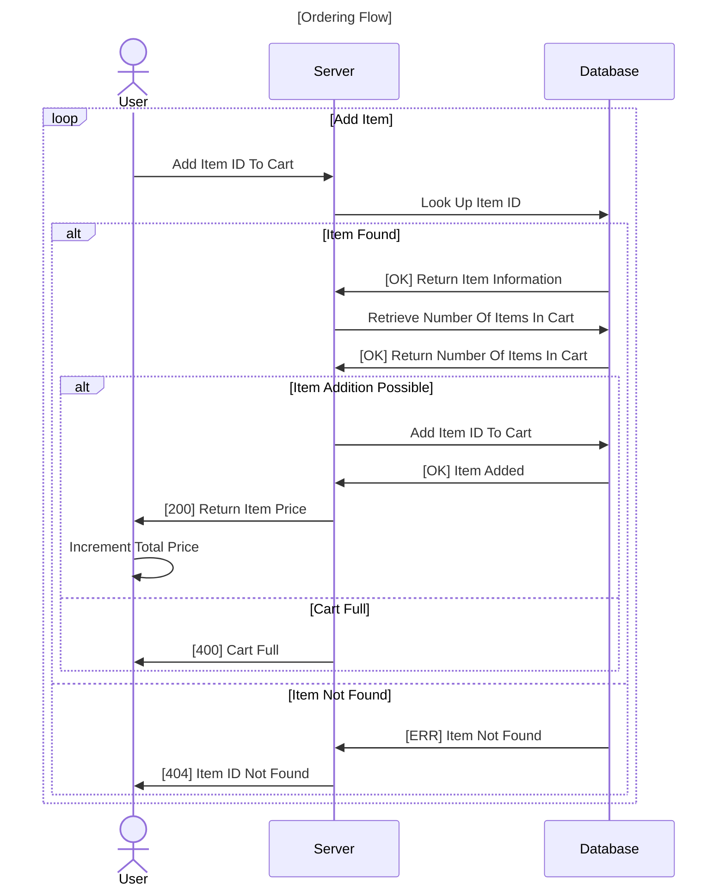
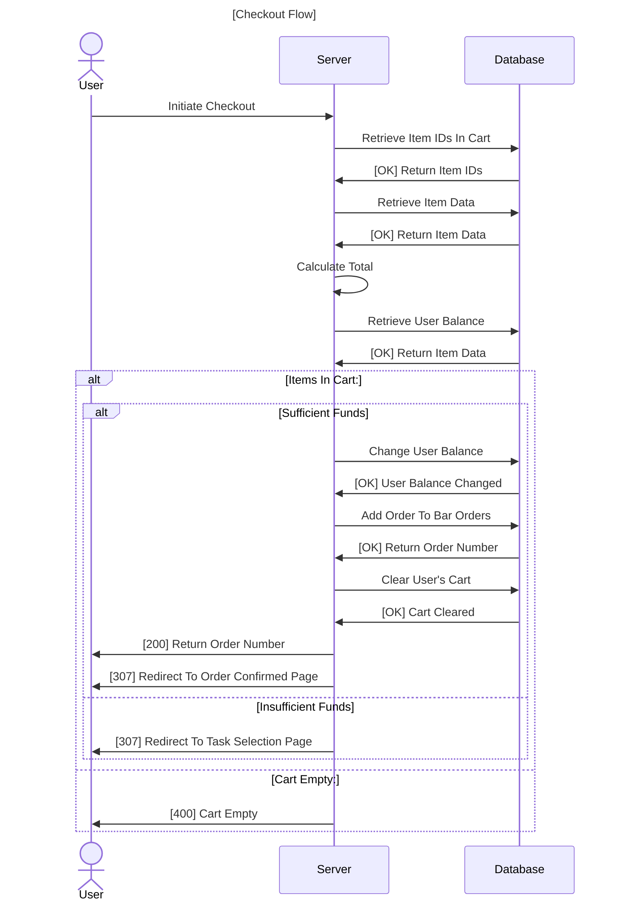

# Dataflow

'_Bigdata_'

## Login Flow

```mermaid
sequenceDiagram
    Title [Login User Flow]
    actor User
    loop Login
        User->>Server:Submit Code
        Server->>Database:Lookup Code
        alt Correct Code
            Database->>Server:[OK] Return Username
            loop Generate Session Token
                Server->>Server:Generate Random Session Token
                Server->>Database:Look Up Session Token
                alt Unique Session Token
                    Database->>Server:[OK] Session Token Not Found
                else Taken Session Token
                    Database->>Server:[ERR] Session Token Found
                end
            end
            Server->>Database:Add Session Token
            Database->>Server:[OK] Added
            Server->>User:[200] Return Session Token
            Server->>User:[200] Return Username
            Server->>User:[307] Redirect To Order Page
        else Incorrect Code
            Database->>Server:[ERR] User Not Found
            Server->>User:[401] Invalid Code
        end
    end
```

## Adding Items To Cart Flow

```mermaid
sequenceDiagram
    Title [Ordering Flow]
    actor User
    loop Add Item
        User->>Server:Add Item ID To Cart
        Server->>Database:Look Up Item ID
        alt Item Found
            Database->>Server:[OK] Return Item Information
            Server->>Database:Retrieve Number Of Items In Cart
            Database->>Server:[OK] Return Number Of Items In Cart
            alt Item Addition Possible
                Server->>Database:Add Item ID To Cart
                Database->>Server:[OK] Item Added
                Server->>User:[200] Return Item Price
                User->>User:Increment Total Price
            else Cart Full
                Server->>User:[400] Cart Full
            end
        else Item Not Found
            Database->>Server:[ERR] Item Not Found
            Server->>User:[404] Item ID Not Found
        end
    end
```

## Checkout Flow

```mermaid
sequenceDiagram
    Title [Checkout Flow]
    actor User
    User->>Server:Initiate Checkout
    Server->>Database:Retrieve Item IDs In Cart
    Database->>Server:[OK] Return Item IDs
    Server->>Database:Retrieve Item Data
    Database->>Server:[OK] Return Item Data
    Server->>Server:Calculate Total
    Server->>Database:Retrieve User Balance
    Database->>Server:[OK] Return Item Data
    alt Items In Cart:
        alt Sufficient Funds
            Server->>Database:Change User Balance
            Database->>Server:[OK] User Balance Changed
            Server->>Database:Add Order To Bar Orders
            Database->>Server:[OK] Return Order Number
            Server->>Database:Clear User's Cart
            Database->>Server:[OK] Cart Cleared
            Server->>User:[200] Return Order Number
            Server->>User:[307] Redirect To Order Confirmed Page
        else Insufficient Funds
            Server->>User:[307] Redirect To Task Selection Page
        end
    else Cart Empty:
        Server->>User:[400] Cart Empty
    end
```

TODO Add Task Selection Flow.
TODO Add Flows For Bar.
