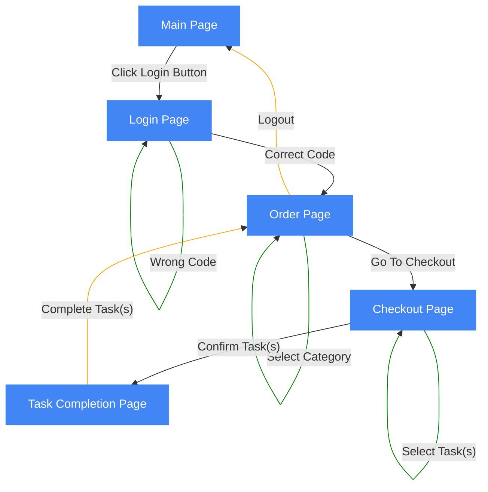

# Userflow UX design

This document serves primarly to visualize the complexity of a user's journey through the ordering process.

```mermaid
flowchart TB
    a[Main Page] -- Click Login Button --> b[Login Page]
    b -- Correct Code --> c[Order Page]
    b -- Wrong Code --> b
    c -- Add Item To Order --> c
    c -- Select Category --> c
    c -- Logout --> a
    c -- Go To Checkout --> d[Checkout Page]
    d -- Select Task(s) --> d
    d -- Confirm Task(s) --> e[Task Completion Page]
    e -- Complete Task(s) --> c

    classDef page fill:#4285F4,stroke:#4285F4,color:#FFFFFF;
    class a,b,c,d,e page
    linkStyle default stroke:3F4145;
    linkStyle 5,9 stroke:orange;
    linkStyle 2,3,4,7 stroke:green;
```
